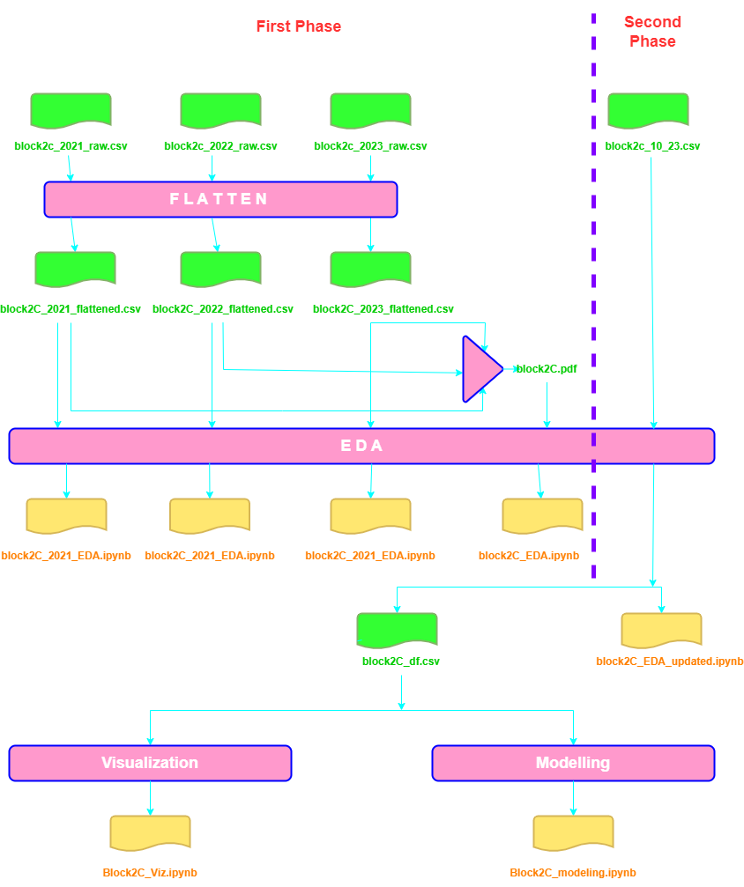

<h1>Analysing Tuberculosis Cases in Kaduna 2019-2023</h1>

 This project was part of colab between Omdena and Kaduna Local Authorities. About 15-20 people were working on the project at different stages of Data Collection, EDA, Visualization, Modeling, Deployment And Presentation. Here is the final result of approx. 3 months of hardwork and teamwork.

<a href="https://dagshub.com/Omdena/KadunaNigeriaChapter_Tuberculosis">Dagshub Repo</a>
<a href="https://kadunastatetbanalysis.streamlit.app/">Dashboard App</a>

 I was mainly part of EDA and Visualization team although I wanted to be involved in all phases. The data collected was divided into blocks where I worked on Block2C. The contents of the blocks were slightly different from each other, so is the focus of Analysis.

<section>
<h2>EDA</h2>

 For starting phase, The data was separated in years[for each block],So separate analysis for each year 2021,2022,first_half-2023 and then combined analysis for whole period was done.

 At later stages, the new data was added from 2019,2020 and second_half-2023. The EDA for combined period of 2019-2023 was performed. 

 This phase involved analysing inconsistencies like null values, outliers,data_types and data_values etc. as well as analysing  distributions of the data. Using Python and Plotly the task was completed very effectively.

Because of the amazing work of the data preprocessing team and simplicity of data there were no major challenges.
But few minor as challenges mentioned below - 

<ol>
<li>Few Null values were present which were imputed with zero.</li>
<li>The names of LGAs were slightly different from references which were corrected.</li>
<li>The data format for columns "LGA" and "Age_Gr" for 2021 were different from that of 2022 and 2023, so for combined EDA changes data was replaced in 2021 to maintain consistency.</li>
</ol>
<h3>Here are some of the findings from the Block2C_EDA_updated.</h3>
<li> The dataset was balanced w.r.t. all features</li>
<li> The dataset contained 14 original and 1 engineered(Year_Quarter)</li>
<li>The data was from 2019-2023</li>
<li>Column 'Total'[later 'TB_Cases'] had some mislleneous values.</li>
<li>'TB_Cases' column was right skewed with most of the values less than 10.</li>
</section>

<section>
<h2>Visualization</h2>
Plotly was used during this phase to showcase trends and insights related to TB Cases w.r.t different demographics.
Here are the some of vizs - 

</section>

<section>
<h2>Modeling</h2>
Although could not be part of modeling team, I tried to create clustring based model for the data using K-means, DBSCAN, Gaussian Mixtures algoritms.
The data was scaled using both StandardScaler and MinMaxScaler.

Elbow Method was used for finding Optimal K in KMeans.
K-distance Graph was used for finding Optimal eps values in DBSCAN.
AIC and BIC score were used for finding n_components in Gaussian Mixtures.

Total 8 clusters were formed based on evaluations.

The Silhouette Score was used as a metric for performance evaluations.

Silhouette score for final models were:
<ol>
<li>KMeans: 0.4121</li>
<li>DBSCAN: 0.4121</li>
<li>GMM: 0.4377</li>
</ol>

The Assigned clusters are - 

</section>